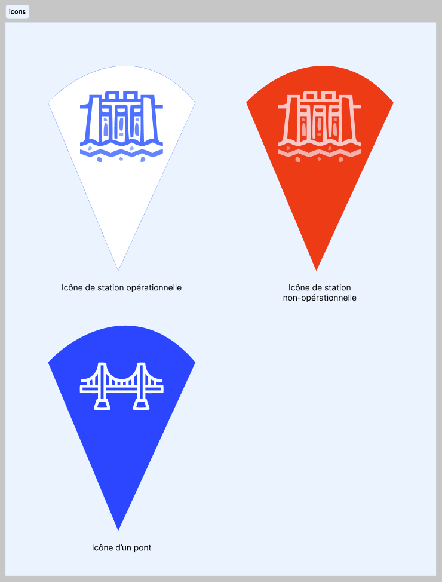

# Front-end part of the project 🚀

## Description 📄

This is the front-end part of the project. It is an Angular project that provides a user interface to interact with the back-end of the project.

## Installation 🛠

1. Clone the repository
2. Install the dependencies

```bash
npm install
```

3. Start the server (do not forget to start the back-end server first, [have a look here](../back_bridge_project/README.md))

```bash
ng serve
```

## Icons

Icons used were created on Figma.


